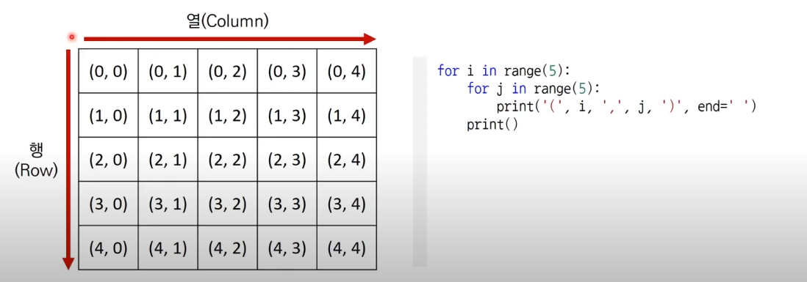
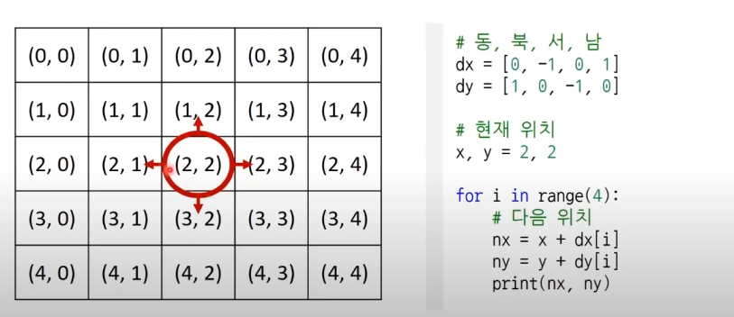

# [구현 (Implementation)](https://www.youtube.com/watch?v=2zjoKjt97vQ&list=PLRx0vPvlEmdAghTr5mXQxGpHjWqSz0dgC&index=3)
- 흔히 알고리즘 대회에서 구현 유형의 문제란
  - 풀이를 떠올리는 것은 쉽지만 소스코드로 옮기기 어려운 문제를 지칭 
- 구현의 유형의 예시
  - 알고리즘은 간단한데 코드가 지나칠만큼 길어지는 문제 
  - 실수 연산을 다루고, 특정 소수점 자리까지 출력해야 하는 문제 
  - 문자열을 특정한 기준에 따라 끊어 처리해야 하는 문제
  - 적절한 라이브러리를 찾아서 사용해야 하는 문제 
  
- 일반적으로 알고리즘 문제에서 2차원 공간은 행렬(Martrix, 언어별 Array,List 등)의 의미로 사용된다. 

- 시뮬레이션 및 완전 탐색 문제에서는 2차원 공간에서 방향 벡터가 자주 활용된다. 

  동,북,서,남의 각각의 방향 벡터 dx,dy를 이용해서 이동할 수 있다.
